# 국제 대학생 창작 자동차 경진대회

## 1. 대회 개요
K-CITY에서 다양한 미션을 수행하는 자율주행 자동차를 설계하는 [경진대회](http://www.kasa.kr/cev/)입니다. 신호등 인식, 장애물 회피, 긴급 제동(돌발장애물) 등과 같은 미션을 수행합니다. 대회는 국토부, 자동차안전연구원, 자동차공학회에서 주관하며 학부생위주의 대회입니다. 

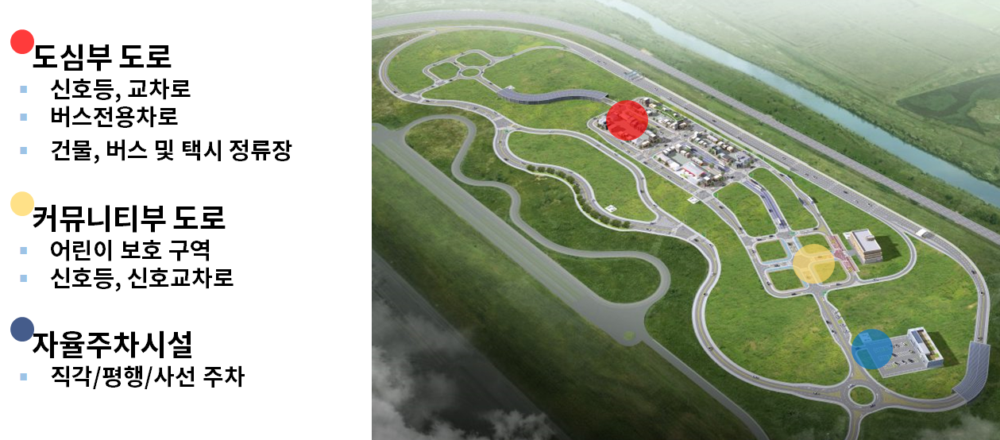

## 2. 시스템 구성도
시스템은 다음과 같이 구성했습니다. 알고리즘은 ROS(로봇 프레임웤)를 사용해서 구현했습니다. 
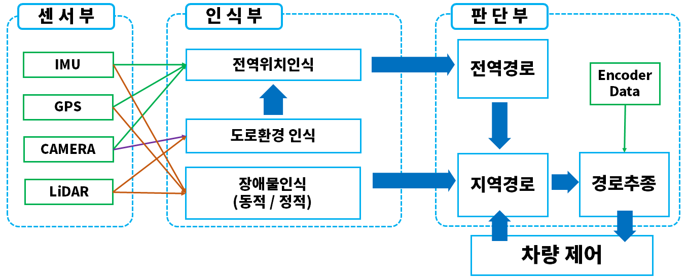

    
## 3. 하드웨어

### - 차량 플랫폼
차량플랫폼은 위고코리아의 ERP-42를 사용했다. 플랫폼의 PUC와 Serial 통신을 통해 차량 제어 및 센서데이터(엔코더, 조향각, 상태) 등을 쉽게 주고 받을 수 있다. 

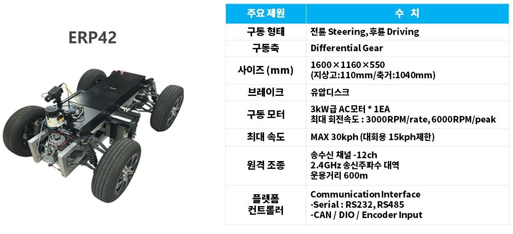

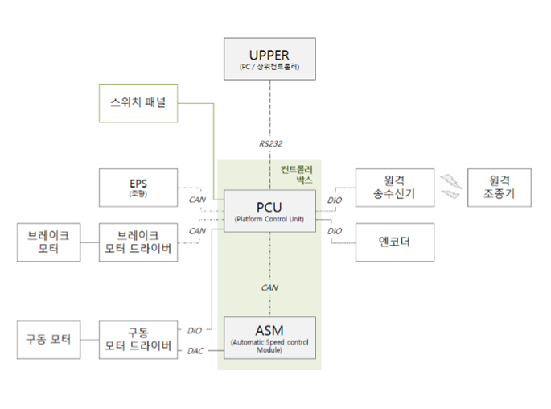

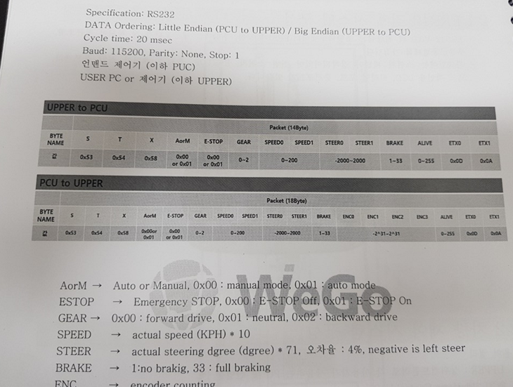

### - 시뮬레이터

시뮬레이터를 사용해서 직접 K-CITY에 가지 않아도 주행 실험을 해볼 수 있었다. GPS, Lidar 데이터를 받아서 Path tracking, Local Path Planning 알고리즘을 설계하고 검증했다.

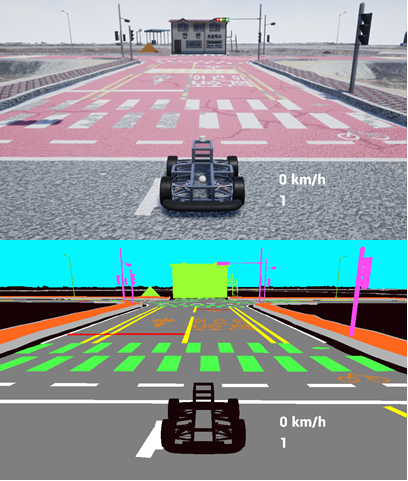

> 주행테스트

## 4. 소프트웨어

### -경로추종

경로추종은 [Pure Pursuit](https://www.ri.cmu.edu/pub_files/2009/2/Automatic_Steering_Methods_for_Autonomous_Automobile_Path_Tracking.pdf )을 이용했습니다. 비교적 저속(최대 20 km/h)이므로 동역학을 고려하지 않아도 충분히 주행가능하고, 수식이 매우간단해서 Pure Pursuit을 사용했습니다.

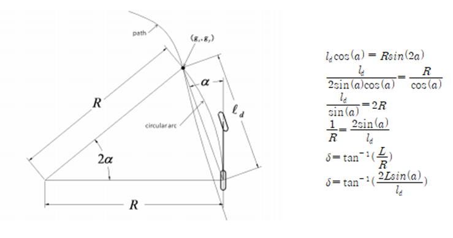
> Pure Pursuit geometry 

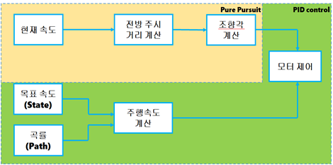
> 경로추종 알고리즘

속도는 위치기반으로 상태를 나누어 각 상태별로 최대, 최소 주행 속도내에서 주행하게 했고, 경로의 곡률에 따라 곡선에서는 감속하도록 했다. 경로가 주어진다면 [최소자승법](https://ko.wikipedia.org/wiki/%EC%B5%9C%EC%86%8C%EC%A0%9C%EA%B3%B1%EB%B2%95)을 이용해 원 또는 3차,5차 방정식으로 Fitting해서 곡률을 구할 수 있습니다.

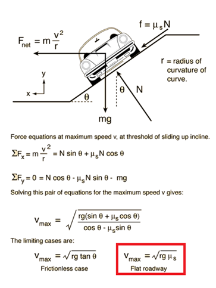

### - 위치인식

gps에서 들어오는 데이터의 프로토콜을 확인하고 위도경도로 되어있는 구좌표계를 직교좌표계로 변환해서 사용해야합니다.

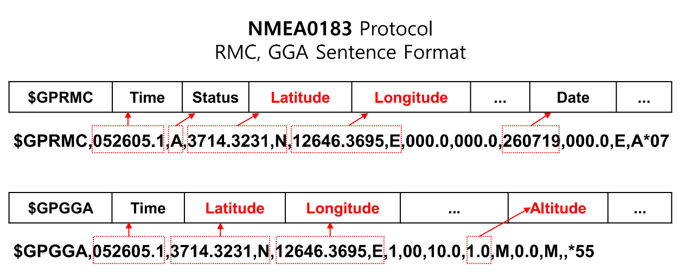
> garmin gps 데이터

시뮬레이터의 gps 데이터는 garmin gps와 동일한 프로토콜로 들어오고, 파싱을 한 후 직교좌표계로 바꾸면 다음과 같이 x,y,z값을 얻을 수 있다. 시뮬레이터를 통해 얻은 좌표는 실제 k-city와 동일한 좌표이다.

실제 GPS는 날씨나 주변환경의 영향을 많이 받기 때문에 보정이 필요하다. Imu와 차량에서 주는 속도데이터를 이용해 GPS가 튀는 시간동안 위치를 보정해준다.

> 위치보정모습

보라색원은 gps의 공분산(에러)를 나타내는데 중간에 위치가 잡히지 않아 지도밖으로 사라졌지만, 위치보정을 통해 gps의 위치가 잡히지 않는 구간동안 다른센서로 버텨줘서 주행을 할 수 있었다. 

## 5. 결과영상

[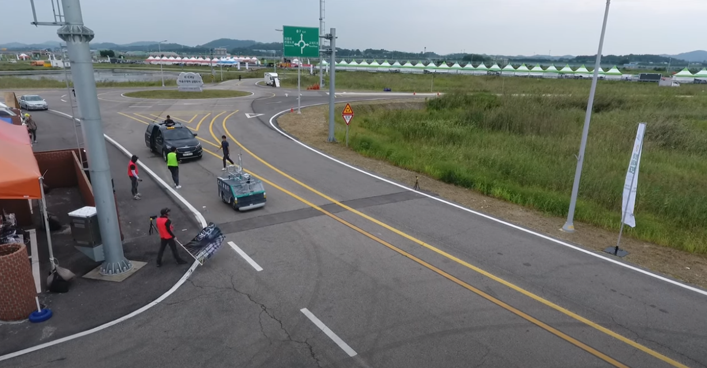](https://youtu.be/pSSipBlQLOQ)

> 사진을 클릭하면 동영상이 재생됩니다(유튜브)

