# 자율주행 서빙로봇

## 1. 개요

ROS의 Navigation Stack을 이용해서 실내공간 지도작성 후 지도기반 위치인식을 바탕으로 자율주행 서빙로봇을 제작했다. 
카트는 어플을 통해서 손님이 주문을 하게되면 요리사(주방)에게 주문정보가 전달되고, 카트는 손님이 주문한테이블로 이동하게된다. 카트에 있는 주문완료버튼을 누르면 카트는 원래있던 자리로 되돌아가게 된다. 어플을 통해 카트의 위치를 볼 수 있다.

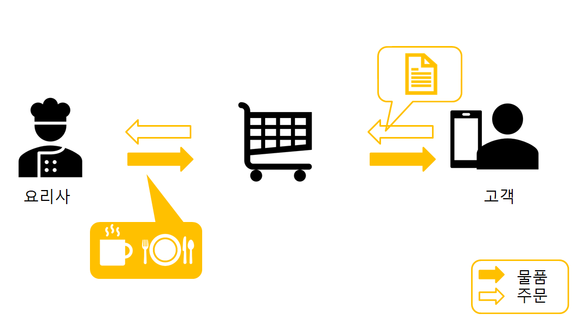

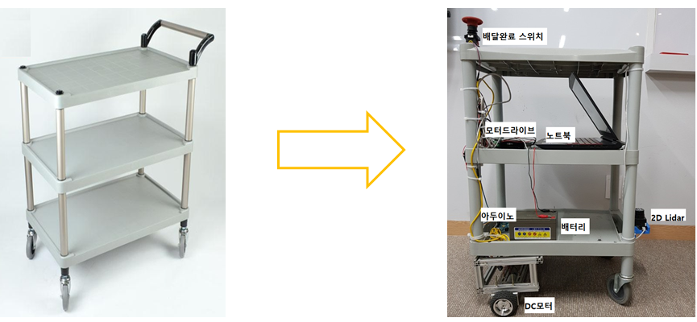
> 카트모습

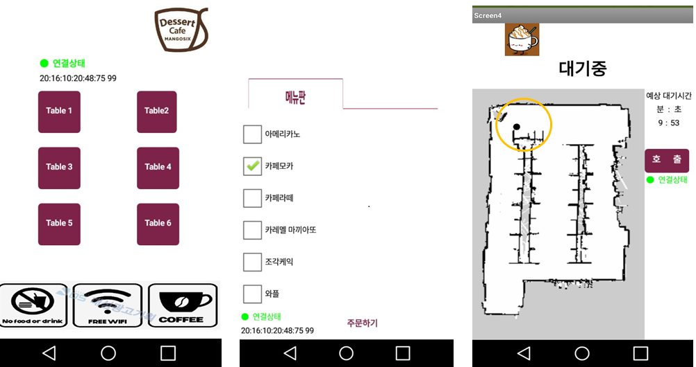
> 주문앱

## 2. 하드웨어

하드웨어 구성은 다음과 같다.

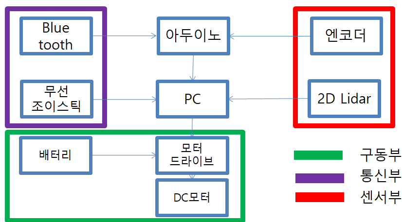
> 주문앱

### - 블루투스
블루투스는 어플리케이션과 통신하기 위해 사용했다. 어플리케이션은 주문정보를 블루투스를 통해서 알려주고 아투이노와 PC는 ROS_Serial을 통해서 PC로 주문정보를 전달한다. 반대로 PC에서는 카트의 위치를 어플리케이션에 전달해서 실시간으로 카트의 위치를 어플리케이션에서 확인할 수 있게 했다. 

### - 조이스틱
조이스틱은 카트를 수동 조종하기 위해서 사용했다. ROS에 [JOY](http://wiki.ros.org/joy) 패키지를 이용해서 쉽게 조종기능을 구현했다.

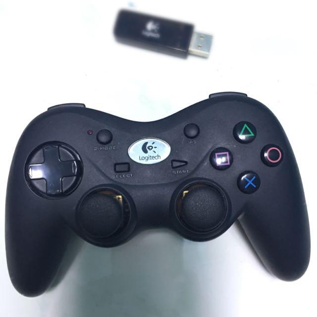
> 로지텍 무선 조이스틱

### -엔코더모터

모터는 엔코더가 내장된 모터를 사용했다. 엔코더를 통해서 각 바퀴의 속도를 추정했고, 이것을 피드백으로 바퀴의 속도제어를 했다.

### -2D Lidar
라이다는 Mapping, Localization을 위해 사용했다. ROS의 [rf2o_laser_odometry](http://wiki.ros.org/rf2o_laser_odometry) 패키지를 이용해 Odometry를 구하고, ROS의 [Gmapping](http://wiki.ros.org/gmapping) 패키지를 이용해 지도를 작성했다. 위치인식은 ROS의 [AMCL](http://wiki.ros.org/amcl) 패키지를 사용했다. ROS 패키지를 최대한 활용해서 Navigation을 완성했다.

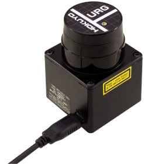
> hokuyo lidar

### - 모터드라이브

모터의 전류가 높기 때문에 허용전류가 15A인 모터드라이브를 사용했다. 2ch이고, RS-232 통신을 통해 각 채널에 전앞을 줄 수 있다.

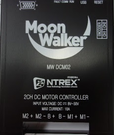
> 엔티렉스 모터드라이버

## 2. 소프트웨어
소프트웨어 구성은 다음과 같다. 

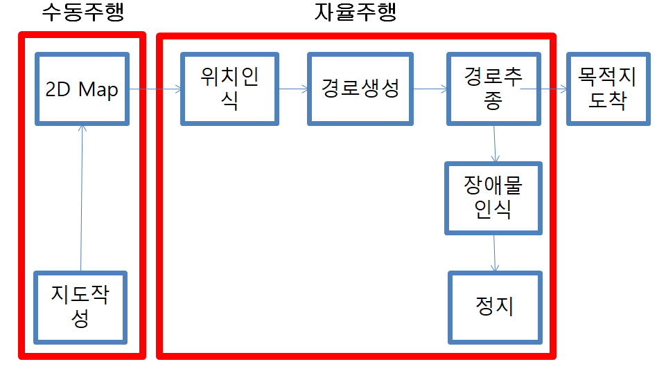
> 소프트웨어 구성도

### - 지도작성
ROS의 Gmapping 패키지를 사용하기 위해서는 라이다 스캔데이터, 주행기록(Odometry) 토픽이 필요하다. 카트는 Differential Drive Model 이다.
양쪽속도의 속도를 알면 Odometry를 알 수 있다. 하지만 바퀴와 지면과의 슬립, 노이가 누적된다는 점 때문에 엔코더기반의 Odometry를 사용했을 때 지도가 매우 부정확하다. 따라서 Lidar 기반의 Scan Matching 기반의 Odometry를 사용했다.

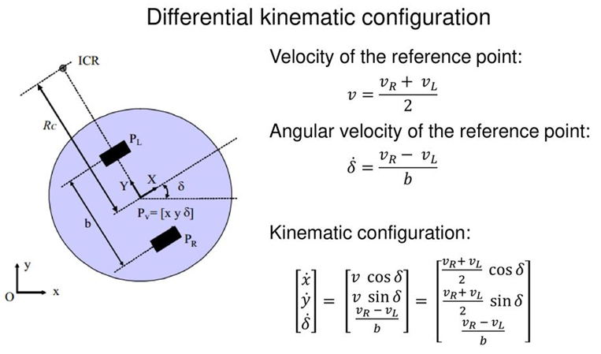
> 카트의 키네마틱

- 엔코더는 회전에 대한 오차가 커서 결국 오차가 누적되서 사용하기 힘듬. 사용하려면 다른센서와의 융합이 필요

- 라이다 기반의 Odometry는 특징점이 많은 곳에서 성능이 뛰어남. 특징점이 없는 환경에서는 오차가 커짐.

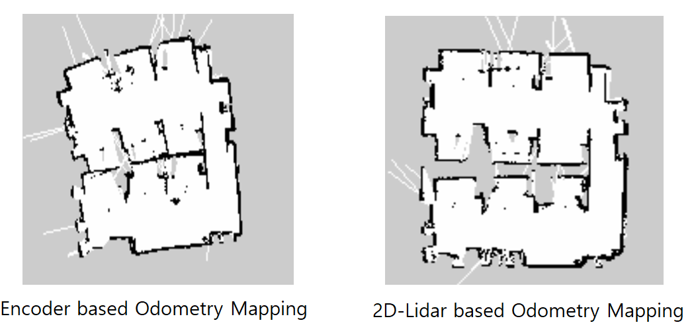

실제 주행환경은 다음과 같이 특징점이 많은 환경을 선택했다.

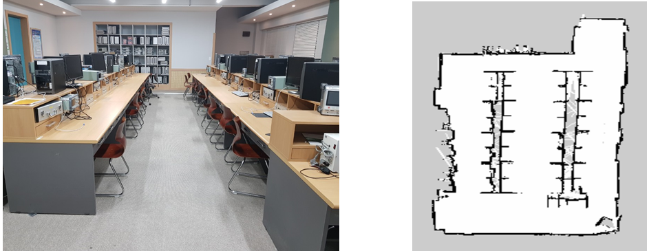
> 실제 시연환경 및 지도

### - 위치인식

위치인식은 파티클 필터 기반의 Adaptive Monte Carlo Localization(AMCL)을 사용했다. 2D환경에서 뛰어난 위치인식 성능을 가진다. 초기위치는 직접 잡아줘야 한다.
또한 지도를 잘 만들어야 한다.

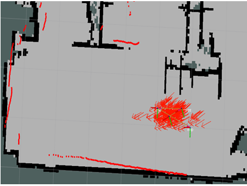
> 위치인식

### - 경로생성

모든 테이블까지의 경로를 직접 만들어서 저장한 후 사용함. 경로계획은 하지 않고 저장한 경로들을 Load해서 사용했다.

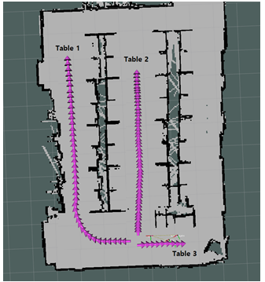
> 미리 만들어둔 경로 사용

### - 모터제어

카트의 모터를 직접 개조하여 달았기 때문에 Wheel Alienment이 맞지 않았다. 또한 카트의 무게중심이 가운데 있지 않고, 카트의 무게 때문에 모터가 안쪽으로 굽는 Negative Camber 상태였다.

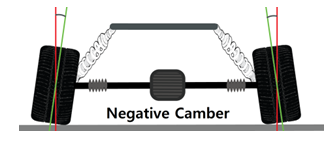

따라서 두개의 모터를 각각 모델링해서 사용했다.

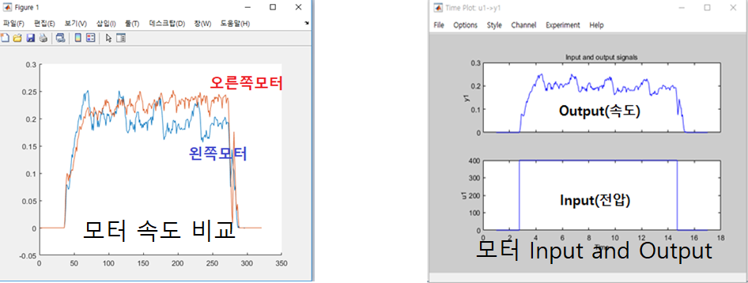

모델링 결과를 이용해 PID제어를 통해 모터제어를 했다. Matlab에 있는 툴박스르 이용해 쉽게 모델링 후 PID게인을 얻을 수 있다.

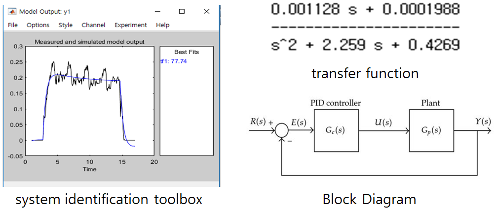

## 3. 시연 및 결과 영상

[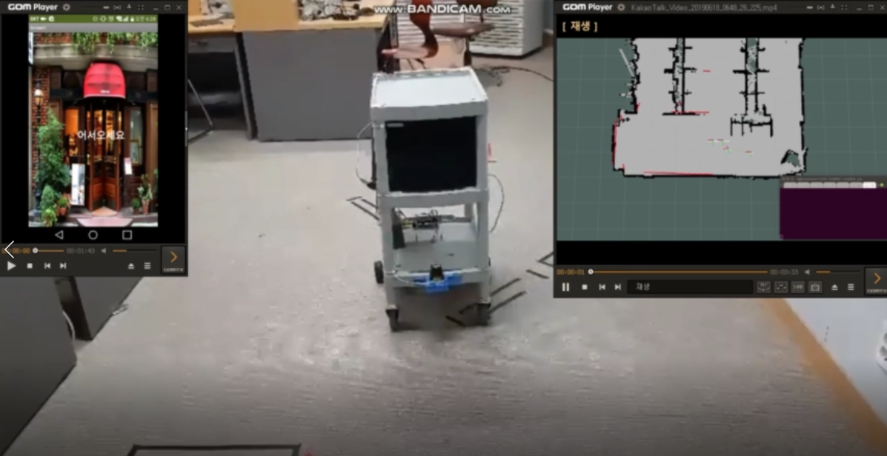](https://youtu.be/cHzfw_xaYCM)

> 사진을 클릭하면 동영상이 재생됩니다(유튜브)

