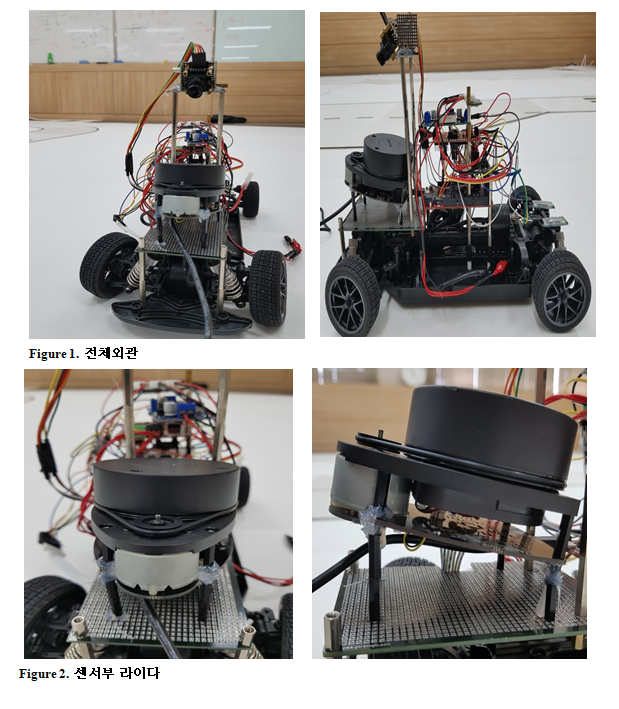

# 한양대 지능형 모형차 대회

## 1. 대회설명

한양대 지능형 모형차 대회는 Infineon 사의 Aurix 보드, 모터 드라이버, 모형차가 주어진 하드웨어, 소프트웨어를 직접 설계하여 주어진 미션을 해결하는 대회이다. 주된 미션은 긴급제동(AEB), 차선유지(LKAS), 속도제어, 장애물회피이다.

>본선 트랙

> aurix tc-275

> motor driver
## 2. 하드웨어 설계 

하드웨어는 다음과 같이 설계했다.

> 하드웨어 구성도

> 센서 활용

### - 카메라
차선인지를 위해 카메라는 CCD라인카메라를 사용했다. 해상도는 1*128 이다. 각 픽셀은 12bit(0~4095)의 값을 가지고, 그레이 스케일로 값을 받는다.

> 라인 카메라 TSL1401CL

CLK을 넣어주고, 타이밍에 맞춰 SI 핀을 LOW -> HOW로 바꾸어주면 A0를 통해서 데이터가 들어온다. 커패시터를 충전해서 사용하므로 최소 충전시간을 고려해서 사용해야한다.

> TSL1401CL 타이밍도

### - 엔코더
엔코더는 차량의 속도를 측정하기 위해 사용했다. 인크리멘탈 엔코더를 사용했다. A,B 상을 이용해서 펄스의 위상차이를 비교해 CW,CCW를 파악하고, 일정시간 동안 몇개의 펄스가 들어오는지 count해서 차량의 이동거리, 속도를 추정했다.

> 오토닉스 E30S

> 엔코더 타이밍도

### - 라이다
장애물회피를 하기 위해 라이다를 사용했다. 기존에는 장애물회피를 위해 거리센서(적외선)를 사용했는데 거리데이터를 피드백받아서 회피에 사용할 수 없어서 라이다를 사용했다.  

> RPLIDAR-A1

라이다를 직접 사용하기 위해서 라이다의 통신프로토콜을 보고 파싱해서 사용했다. 극좌표계(각도, 거리)로 데이터가 들어온다. 

> 라이다 파싱 후 Matlab Plot

### - 블루투스

블루투스는 두개를 사용했다. 첫번째는 실험을 위해 원격조종용으로 사용했다. 두번째는 매트랩에 데이터를 보내 들어오는 데이터를 실시간으로 시각화 하기위해 사용했다. 블루투스를 사용해서 개발시간을 단축할 수 있었다. 

## 3. 소프트웨어 설계 
소프트웨어는 다음과 같이 설계했다. tc-275에는 코어가3개 있어서, 다음과 같이 활용했다. 라이다는 데이터가 비교적 많기 때문에 Core1에 할당했고, 블루투스 역시 라이다, 카메라 데이터를 전송하는데 시간이 오래걸리기 때문에 제어알고리즘에 영향을 주지않게 Core2에 할당해서 사용했다.

> 소프트웨어 구성도

### - 차선검출
카메라로 받은 Raw 데이터는 노이즈가 많아서 필터를 이용해 노이즈를 줄였고, 카메라를 하나만 이용하고 시야각이 좁기 때문에 코너에서도 차선을 감지 할 수 있게 왼쪽차선, 오른쪽차선의 탐색 범위를 가변적으로 변하게 했다.

### - 스쿨존 인식
스쿨존구간에 들어갈 때와 나올 때 대회규정에 의해 횡단보도 모양의 모습이 나온다. 횡단보도 모양에서 카메라 데이터가 큰 값이 많이 나온다. 이 점을 이용해서 스쿨존을 인식했다.

### - AEB
긴급제동은 트렉의 제일 마지막 구간에서 나온다. 스쿨존이 아닌데 앞에 장애물이 있으면 멈추면된다.
라이다 데이터를 극좌표계 -> 직교좌표계로 변환해서 장애물 판단이 가능하다.

### - 속도제어(PID)

속도제어는 PID제어기를 사용했다. Matlab에 Identification tool을 이용해서 모터를 모델링하고, 시뮬링크의 Auto tune 기능을 이용해 PID 게인을 구해서 사용했다. PID제어를 사용하지 않고 그냥 P제어만 사용하면 언덕을 넘지 못 한다.

> 
