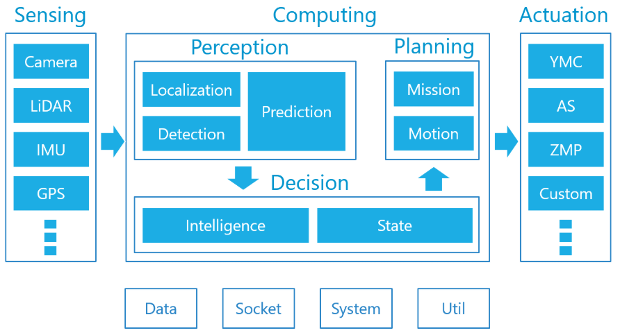
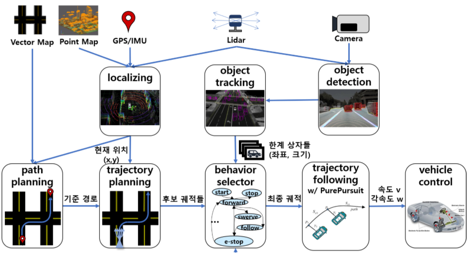
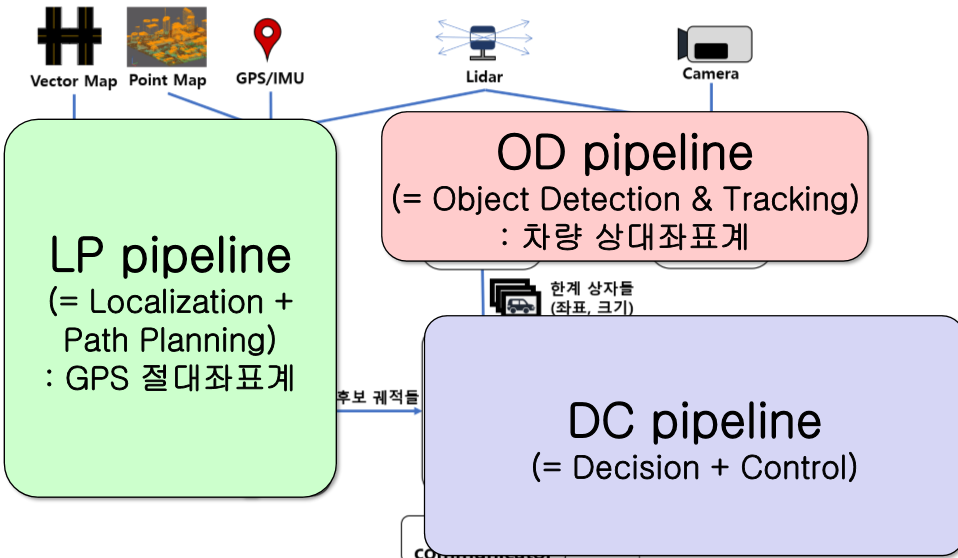

# [Autoware.ai](https://gitlab.com/autowarefoundation/autoware.ai/autoware) 

### 1. [개발환경 구성](1/README.md)
### 2. [시뮬레이션 실행]()
### 3. [로그파일 실행]()

---

오토웨어는 자율주행 개발 /시뮬레이션 오픈소스 프로젝트입니다. Autoware.ai는 ros1기반, Autoware.auto ros2기반입니다. 본 내용은 한국정보과학회 자율주행컴퓨팅연구회의 [Autoware 세미나](https://css.or.kr/adc2019/)를 듣고 만든 자료입니다.

Localization :3차원 포인트 맵(pcd), 라이다 센서를 주로 사용, Imu, GPS와도 센서 융합 가능

Obstacle Detection : 라이다, 카메라

Path Planning : Autoware의 벡터 맵 기반

Path Following : pure pursuit, mpc

> https://github.com/khkim545/autoware_workshop_2019

> https://github.com/khkim545/autoware_workshop_2019

