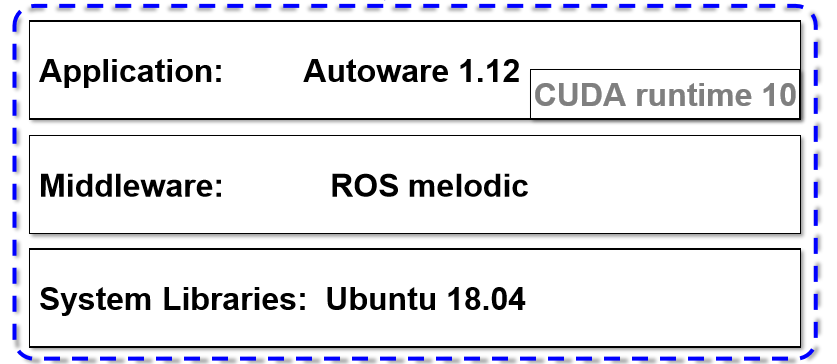

# [Autoware.ai](https://gitlab.com/autowarefoundation/autoware.ai/autoware) 

오토웨어는 자율주행 개발 /시뮬레이션 오픈소스 프로젝트입니다. Autoware.ai는 ros1기반, Autoware.auto ros2기반입니다. 본 내용은 한국정보과학회 자율주행컴퓨팅연구회의 [Autoware 세미나](https://css.or.kr/adc2019/)를 듣고 만든 자료입니다.

Localization :3차원 포인트 맵(pcd), 라이다 센서를 주로 사용, Imu, GPS와도 센서 융합 가능

Obstacle Detection : 라이다, 카메라

Path Planning : Autoware의 벡터 맵 기반

Path Following : pure pursuit, mpc

> https://github.com/khkim545/autoware_workshop_2019

> https://github.com/khkim545/autoware_workshop_2019

## 1. 개발환경 구성

> https://github.com/khkim545/autoware_workshop_2019

- Host에 개발환경 구성
    
    Host에 직접 Nvidia 그래픽 드라이버, ROS, Cuda, 종속라이브러리 등을 직접 설치한다.

- Docker의 컨테이너에 개발환경 구성

    Image 파일을 만들어 컨테이너에 ROS, Cuda, 종속라이브러리를 설치를 해야 하지만 Image 파일은 Autoware에서 제공하기 때문에 다운받아서 바로 사용할 수 있다. 다만 Nvidia 그래픽 드라이버는 호스트 설치한다. Docker-nvidia를 통해 Host에 있는 그래픽카드를 컨테이너에서 잡아서 사용할 수 있다.

