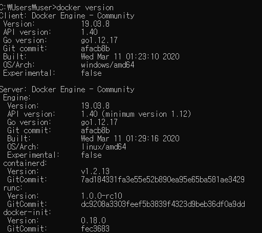
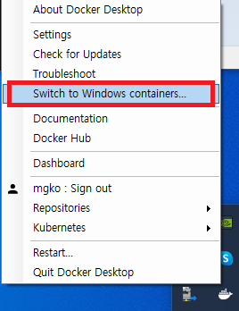
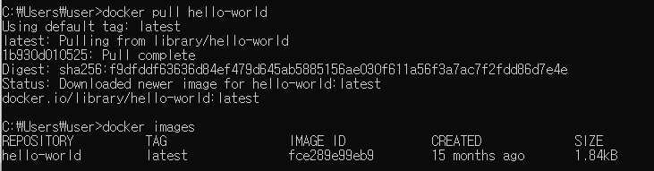
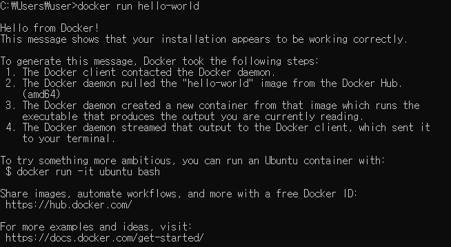
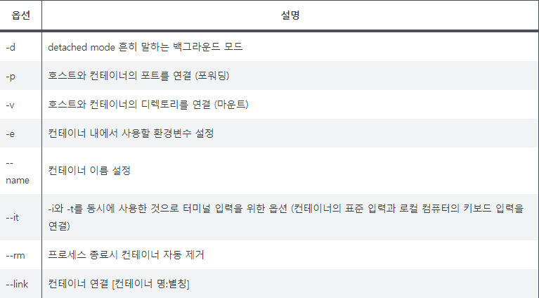

# 도커(Window)

## 1. 설치 및 테스트

도커 공식홈페이지의 다운로드 링크입니다. Docker for Window 버전

[다운하기](https://download.docker.com/win/stable/Docker) 

- 설치확인

  cmd 창을 열어서 다음 커맨드를 입력
    
        docker version

    

    다음과 같이 나오면 정상, client 는 현재 내 PC, server는 도커엔진 정보입니다. OS에 Linux로 되어있는 다음과 같이 클릭해서 윈도우, 리눅스로 엔진 OS를 변경가능

    
    
    

- 테스트용으로 hello-world라는 이미지 파일을 컨테이너로 배포하기
  
        docker pull hello-world
        docker images

    

    서버에있는 hello-world 이미지를 pull 한다. 테그를 적어주지 않으면 최신 버전을 다운로드한다. docker images 명령어를 통해 다운로드가 됬는지 확인할 수 있다. 

        docker run hello-world 

    

    docker run 명령어를 통해 이미지파일을 컨테니어로 배포했다. 

        docker ps
        docker ps -a

    docker ps 명령어는 컨테이너를 확인할 수 있다. docker ps는 현재 실행되고 있는 컨테이너를 보여준다. hello-world는 한번 실행되고 죽었기 때문에 보이지 않음. -a 를 붙이면 실행했던 모든 컨테너를 볼 수 있다.

## 2. docker 명령어

- 이미지 다운

        docker pull <이미지>:<버전>

- 컨테이너 삭제

    컨테이너 아이디는 아이디중 일부만 적어도되지만 Name으로 삭제할려면 Name 전체를 적어줘야 한다. 다른명령어에도 적용

        docker rm <컨테이너 아이디 or Name>
        docker rm $(docker ps -a -q)   #모든 컨테이너 삭제, 관리자 권한 부여한 파워쉘에서 사용해야함

- 이미지 삭제

    -f 붙이면 컨테이너까지 강제 삭제

        docker rmi <이미지 아이디 or Name>
        docker rmi -f <이미지 아이디 or Name>
        docker rmi $(docker images -q)  # 모든 이미지 삭제 관리자 권한 부여한 파워쉘에서 사용해야함

- 컨테이너 실행
  
        docker run <options> image:<Tag> <COMMAND> [ARG]
        docker run --name <이름> <image>    #이름 설정
        docker run -it <image> /bin/bash    # 터미널창을 사용하고
        docker run -d <image> # 백그라운드로 실행
        docker run -it -p 1234:5678 ubuntu /bin/bash # 포트연결
        docker run -v <host 경로>:<컨테이너 경로> <image>     # 공유폴더 마운트
        

        
    
    > https://velog.io/@wlsdud2194/-Docker-%EB%8F%84%EC%BB%A4-%EA%B8%B0%EB%B3%B8-%EB%AA%85%EB%A0%B9%EC%96%B4-%EB%AA%A8%EC%9D%8C

- 컨테이너 시작

        docker start <컨테이너 아이디 or Name>

- 컨테이너 재시작

        docker restart <컨테이너 아이디 or Name>

- 컨테이너 접속
  
    실행중인 컨테이너에 접속할 수 있음. 터미널 종료시 컨테이너도 같이 종료됨.
    
        docker attach <컨테이너 아이디 or Name>

- 컨테이너 정지

    이미 접속중인 터미널에서 컨테이너 정지시 Ctrl+D 또는 Exit 키 누르면 정지

        docker stop <컨테이너 아이디 or Name>
        docker stop $(docker ps -a -q)   #모든 컨테이너 정지, 관리자 권한 부여한 파워쉘에서 사용해야함

- 컨테이너 실행 

    컨테이너에 새로운 프로세스를 실행시킬 때 사용. exec를 통해 실행 후 터미널 종료해도 컨테이너는 종료되지않는다. 하나의 어플리케이션을 실행할 때는 exec를 통해 실행한다.

        docker exec -it <컨테이너 아이디 or Name> /bin/bash

- 파일 복사
    
    - (컨테이너 -> 호스트)

        호스트경로로 컨테이너 경로에있는 파일을 복사해온다.

            docker cp <컨테이너 아이디 or Name>:<컨테이너 경로> <호스트 경로>

    - (호스트 -> 컨테이너)

        호스트경로로 컨테이너 경로에있는 파일을 복사해온다.

            docker cp <호스트 경로> <컨테이너 아이디 or Name>:<컨테이너 경로>

            

## 3 이미지 생성

이미지 -> 컨테이너 배포 후 수정된 사항을 적용한 이미지를 생성할 수 있다. 테그를 붙이지 않으면 항상 최신버전으로 적용됨

  - 컨테이너 변경사항 확인

    base 이미지와 컨테이너가 다른점을 확인

        docker diff <컨테이너 아이디 or Name>

  - 컨테이너 커밋

    커밋하면 현재 컨테이너의 이미지가 생성된다.

        docker commit -m "메시지" <컨테이너 아이디 or Name> <생성이미지 이름>

  - 이미지 Push

    도커 클라우드에 Push 하기위해서는 로그인을 한 상태여야한다. 로그인이 안되있으면 로그인을 하자.

        docker tag <이미지 이름>  <사용자이름>/<명칭>
        docker push <사용자이름>/<명칭>

        

